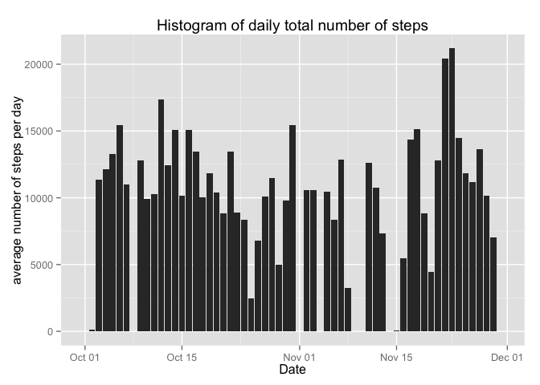
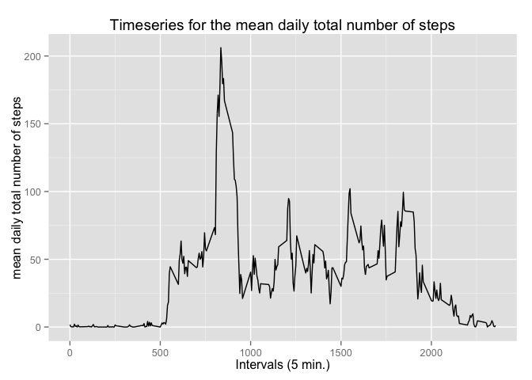
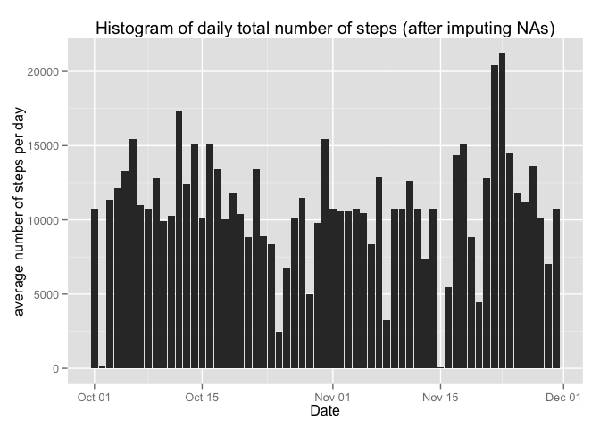

# Reproducible Research: Peer Assessment 1
Cahit Bagdelen  
July 19, 2015  


## Loading and preprocessing the data

### 1. Load the data (i.e. read.csv())


```r
act <- read.csv(unz("activity.zip", "activity.csv"))
str(act)
```

```
## 'data.frame':	17568 obs. of  3 variables:
##  $ steps   : int  NA NA NA NA NA NA NA NA NA NA ...
##  $ date    : Factor w/ 61 levels "2012-10-01","2012-10-02",..: 1 1 1 1 1 1 1 1 1 1 ...
##  $ interval: int  0 5 10 15 20 25 30 35 40 45 ...
```

### 2. Process/transform the data
Convert act$date to Date format:

```r
act$date <- as.Date(act$date)
str(act)
```

```
## 'data.frame':	17568 obs. of  3 variables:
##  $ steps   : int  NA NA NA NA NA NA NA NA NA NA ...
##  $ date    : Date, format: "2012-10-01" "2012-10-01" ...
##  $ interval: int  0 5 10 15 20 25 30 35 40 45 ...
```
The summary of the activity data:

```r
summary(act)
```

```
##      steps             date               interval     
##  Min.   :  0.00   Min.   :2012-10-01   Min.   :   0.0  
##  1st Qu.:  0.00   1st Qu.:2012-10-16   1st Qu.: 588.8  
##  Median :  0.00   Median :2012-10-31   Median :1177.5  
##  Mean   : 37.38   Mean   :2012-10-31   Mean   :1177.5  
##  3rd Qu.: 12.00   3rd Qu.:2012-11-15   3rd Qu.:1766.2  
##  Max.   :806.00   Max.   :2012-11-30   Max.   :2355.0  
##  NA's   :2304
```

## What is mean total number of steps taken per day?

### 1. Histogram of the total number of steps taken each day

```r
totalStepsPerDay <- aggregate(act$steps, by = list(act$date), sum, na.rm = TRUE )
totalStepsPerDay$Date <- as.Date(totalStepsPerDay$Group.1)
library("ggplot2")
ggplot(totalStepsPerDay, aes(x = totalStepsPerDay$Date, y = totalStepsPerDay$x)) + 
    geom_bar(stat="identity") + 
    xlab("Date") + 
    ylab("average number of steps per day") +
    ggtitle("Histogram of daily total number of steps")
```

 

### 2. Mean and median total number of steps taken per day
The mean total number of steps taken per day:

```r
meanStepsPerDay <- aggregate(act$steps, by = list(act$date), mean, na.rm = TRUE )
```

The median total number of steps taken per day:

```r
medianStepsPerDay <- aggregate(act$steps, by = list(act$date), median, na.rm = TRUE )
```

## What is the average daily activity pattern?

### 1. Make a time series plot 
time series plot (i.e. type = "l") of the 5-minute interval (x-axis) and the average number of steps taken, averaged across all days (y-axis)

```r
meanStepsPerInterval <- aggregate(act$steps, by = list(act$interval), mean, na.rm = TRUE )
str(meanStepsPerInterval)
```

```
## 'data.frame':	288 obs. of  2 variables:
##  $ Group.1: int  0 5 10 15 20 25 30 35 40 45 ...
##  $ x      : num  1.717 0.3396 0.1321 0.1509 0.0755 ...
```

```r
ggplot(meanStepsPerInterval, aes(x = meanStepsPerInterval$Group.1, y = meanStepsPerInterval$x)) +
    geom_line() + 
    xlab("Intervals (5 min.)") + 
    ylab("mean daily total number of steps") +
    ggtitle("Timeseries for the mean daily total number of steps")
```

 

### 2. Which 5-minute interval, on average across all the days in the dataset, contains the maximum number of steps?
Maximum number of steps:

```r
max(meanStepsPerInterval$x)
```

```
## [1] 206.1698
```
The interval containing the maximum number of steps: 

```r
meanStepsPerInterval$Group.1[meanStepsPerInterval$x == max(meanStepsPerInterval$x)]
```

```
## [1] 835
```

## Imputing missing values

### 1. total number of missing values in the dataset
the total number of rows with NAs:

```r
sum(!complete.cases(act))
```

```
## [1] 2304
```
the number of NAs in each column of the data frame:

```r
sum(is.na(act$date))
```

```
## [1] 0
```

```r
sum(is.na(act$steps))
```

```
## [1] 2304
```

```r
sum(is.na(act$interval))
```

```
## [1] 0
```

```r
str(act)
```

```
## 'data.frame':	17568 obs. of  3 variables:
##  $ steps   : int  NA NA NA NA NA NA NA NA NA NA ...
##  $ date    : Date, format: "2012-10-01" "2012-10-01" ...
##  $ interval: int  0 5 10 15 20 25 30 35 40 45 ...
```

### 2. Devise a strategy for filling in all of the missing values in the dataset.
Mean of the interval (across all days) can be used to fill the NAs for an interval at a specific date.
As shown above, interval means can be calculated as follows:

```r
meanStepsPerInterval <- aggregate(act$steps, by = list(act$interval), mean, na.rm = TRUE )
```

### 3. Fill missing values:
Create a new dataset that is equal to the original dataset but with the missing data filled in.

```r
act_cmp <- act
n <- nrow(act)
for (i in 1:n) {
    if (is.na(act$steps[i])) {
        interval <- act$interval[i]
        mean <- meanStepsPerInterval$x[meanStepsPerInterval$Group.1 == interval]
        act_cmp$steps[i] <- mean
    }
}
```

Check number of NAs in the new data frame:

```r
sum(is.na(act_cmp$steps))
```

```
## [1] 0
```

```r
sum(!complete.cases(act_cmp))
```

```
## [1] 0
```

```r
str(act_cmp)
```

```
## 'data.frame':	17568 obs. of  3 variables:
##  $ steps   : num  1.717 0.3396 0.1321 0.1509 0.0755 ...
##  $ date    : Date, format: "2012-10-01" "2012-10-01" ...
##  $ interval: int  0 5 10 15 20 25 30 35 40 45 ...
```

### 4. Histogram of the total number of steps taken each day

```r
totalStepsPerDay <- aggregate(act_cmp$steps, by = list(act_cmp$date), sum, na.rm = TRUE )
totalStepsPerDay$Date <- as.Date(totalStepsPerDay$Group.1)
library("ggplot2")
ggplot(totalStepsPerDay, aes(x = totalStepsPerDay$Date, y = totalStepsPerDay$x)) + 
    geom_bar(stat="identity") + 
    xlab("Date") + 
    ylab("average number of steps per day") +
    ggtitle("Histogram of daily total number of steps (after imputing NAs)")
```

 
As we can observe in the histogram, we have values for each interval, now.
